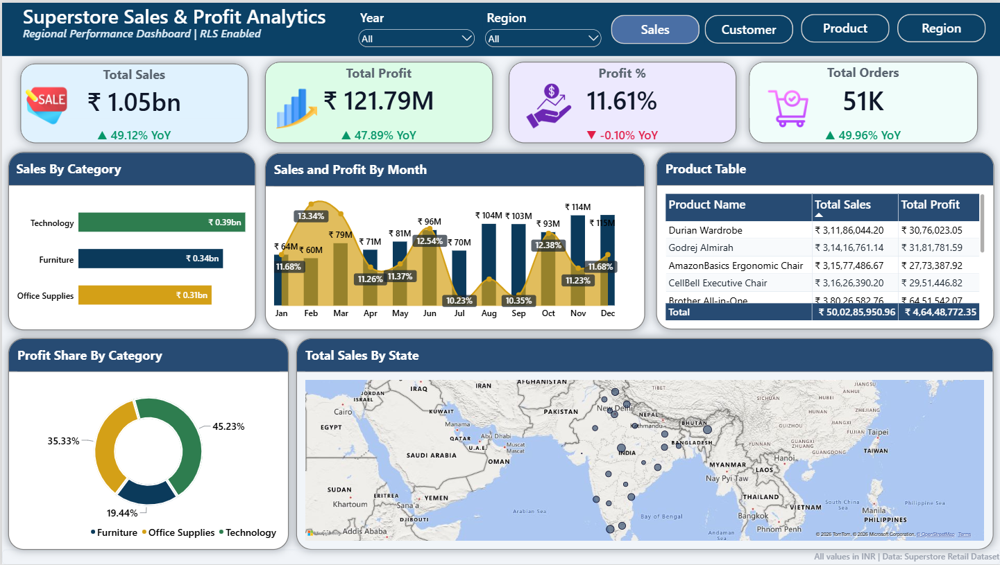
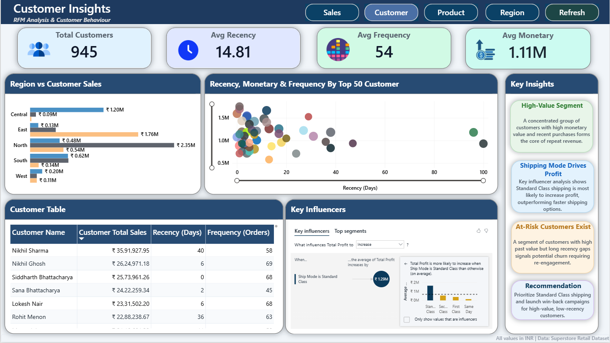
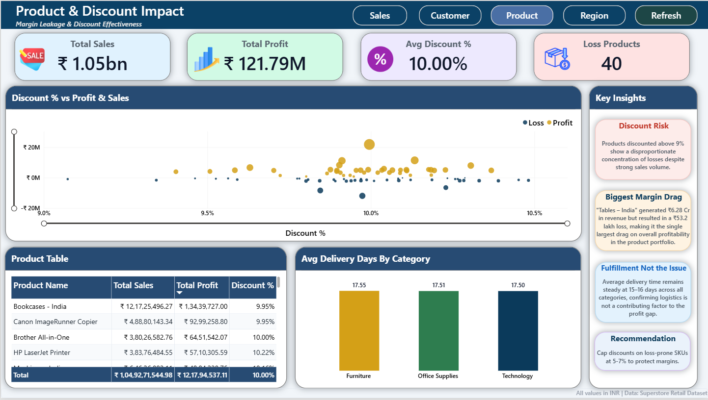
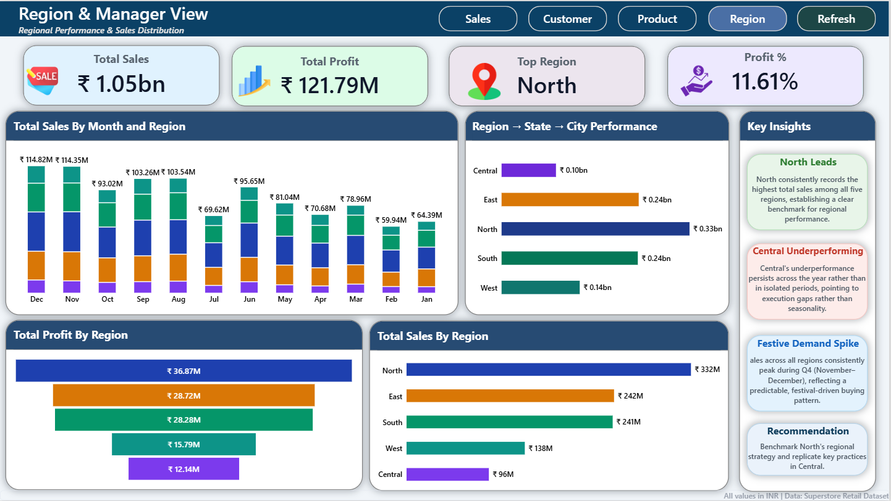
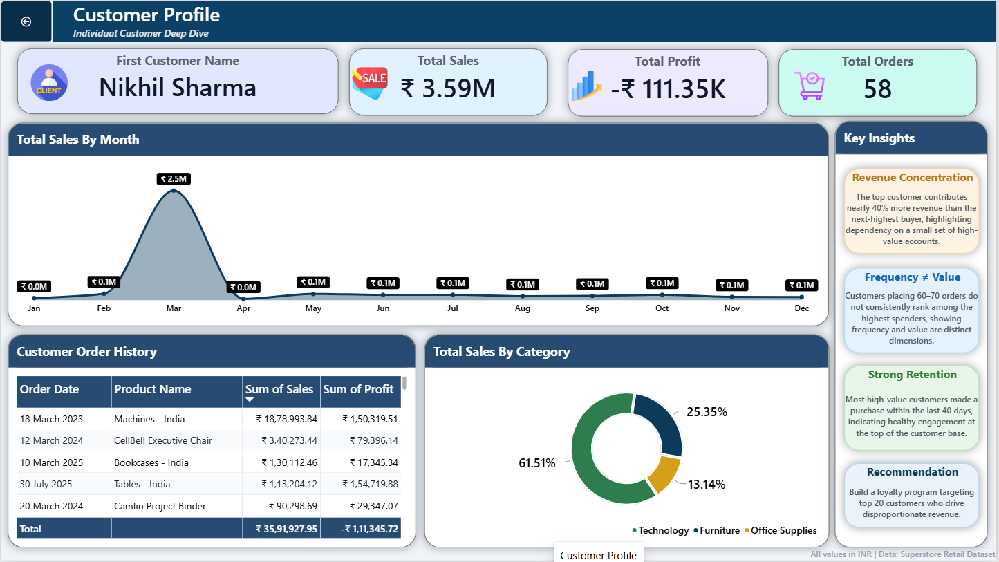
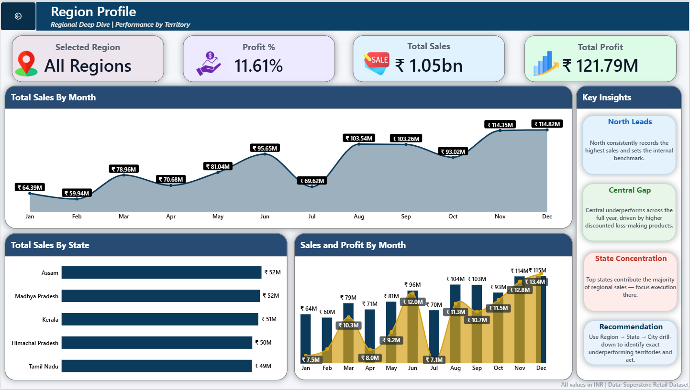

# 📊 Superstore Sales & Profit Analytics
### RLS-Enabled Regional Performance Dashboard | Power BI Capstone Project

---

## 📌 Project Overview

An end-to-end Power BI solution built on the **Indian Superstore** retail dataset. It transforms raw transactional data into a secure, interactive analytics platform where Regional Managers can monitor sales, profit, customer behaviour, and shipping performance, while each manager can access **only their own region's data**.

**What this project delivers:**
- Cleaned and modelled dataset (51,284 orders)
- Star-schema data model with 16+ DAX measures
- Four analytical pages, two drill-through pages, and custom tooltips
- Static Row-Level Security (5 regional roles) and Dynamic RLS using `USERPRINCIPALNAME()`
- Insight summary and complete documentation

---

## 🎯 Business Context

A retail organisation selling Technology, Furniture and Office Supplies across India needed:
- A single decision-ready view of sales, profit, customers, and shipping
- Secure region-wise visibility for Regional Managers
- A way to move from raw data to actionable insights

---

## 📊 Dashboard Preview

### Sales Overview

### Customer Insights (RFM)

### Product & Discount Impact

### Region & Manager View

### Drill-through: Customer Profile

### Drill-through: Region Profile

---

## 📑 Dashboard Pages

| Page | Purpose |
|------|---------|
| **Sales Overview** | KPI cards with YoY indicators, category performance, monthly sales & profit trend, state-level map, top products |
| **Customer Insights** | RFM segmentation, AI Key Influencers, top customers table, Region vs Customer Sales |
| **Product & Discount Impact** | Discount % vs Profit scatter (size = sales, colour = profit/loss), product ranking, delivery-time analysis |
| **Region & Manager View** | Region → State → City hierarchy, regional profit comparison, monthly trend by region |
| **Customer Profile** | Drill-through page with order history and KPIs for an individual customer |
| **Region Profile** | Drill-through page with regional deep-dive (sales, profit, state contribution) |
| **Product / Customer Tooltips** | Hover pages showing live metrics for a product or customer |

---

## 🔍 Key Business Insights

| Metric | Value |
|:---:|:---:|
| Total Sales | ₹1.05bn |
| Total Profit | ₹121.79M |
| Profit Margin | 11.61% |
| Total Orders | 51K |

1. **Growth came from volume, not margin.** Sales grew **+49.12% YoY** and profit **+47.89%**, but margin stayed flat at 11.61% (-0.10% YoY).
2. **Furniture sells well but earns little.** Furniture contributes ₹0.34bn in sales but only **19.44%** of profit (roughly 7% margin), while Technology and Office Supplies earn roughly 14%.
3. **North leads; Central has a volume gap, not a margin gap.** North delivers ₹332M in sales and ₹36.87M profit. Central has the lowest sales (₹96M) but the healthiest margin (~12.6%).
4. **Margin leakage is concentrated.** 40 products are loss-making at a ~10% average discount. **"Tables – India"** is the biggest drag (₹6.28 Cr sales, ₹53.2 L loss).
5. **Logistics is not the issue.** Average delivery is ~17.5 days across all categories.
6. **High sales do not guarantee high profit.** The top customer by sales (₹35.9 L) has a net loss of ₹1.11 L due to loss-making orders.
7. **Standard Class shipping** is associated with higher profit (Key Influencers). This is a correlation, not proof of cause.
8. **Seasonality:** sales peak in Nov–Dec (₹114M+ per month) and dip in Feb (₹60M).

---

## 💡 Recommendations

1. **Review loss-making SKUs:** check pricing and cost on the 40 loss-making products, starting with Tables – India.
2. **Furniture margin review:** investigate cost, pricing and discounting before scaling the category.
3. **Central region growth:** apply North's sales approach to grow volume while protecting Central's strong margin.
4. **Customer retention:** run a loyalty programme for the Top 20 revenue-contributing customers and win-back campaigns for high-value customers with long recency gaps.
5. **Seasonal planning:** align inventory and promotions with the Nov–Dec demand spike.

---

## ⚙️ Technical Implementation

| Area | Details |
|------|---------|
| **Data Model** | Star schema: Orders (Fact) + Date, Zone, Users (Dimensions) |
| **Measures** | 16+ DAX measures including YoY growth, RFM metrics, RANKX, Profit % |
| **RLS – Static** | 5 roles (North, South, East, West, Central) filtering by Region |
| **RLS – Dynamic** | Single role using `USERPRINCIPALNAME()` mapped via Users table |
| **Interactivity** | Bookmarks, navigation buttons, drill-through, custom tooltips |
| **Verification** | All RLS roles tested using **View As** in Power BI Desktop |

---

## 🧹 Data Preparation

- Corrected data types and removed duplicates / blank critical fields
- Removed Postal Code column (100% null)
- Created calculated **Delivery Days** column
- Removed 6 records with invalid 29-Feb-2012 dates that corrupted the Year slicer
- Built a continuous Date table for time intelligence

---

## 📂 Repository Contents

| File | Description |
|------|-------------|
| `Superstore_RLS_Regional_Analytics.pbix` | Power BI report (model, measures, all pages) |
| `Indian_Superstore_Dataset.xlsx` | Source dataset |
| `Dashboard_Screenshots.pdf` | Screenshots of all dashboard pages |
| `Final_Insight_Summary.pdf` | Business-facing insights and recommendations |
| `images/` | Dashboard preview images used in this README |

---

## ▶️ How to Explore

1. Download `Superstore_RLS_Regional_Analytics.pbix` and open it in **Power BI Desktop**
2. Use navigation buttons or bookmarks to move between pages
3. Right-click a **customer** → Drill through → **Customer Profile**
4. Right-click a **region** → Drill through → **Region Profile**
5. Hover over products for the custom **Product Tooltip**
6. Test security: **Modeling → View as →** select a regional role or the Dynamic Access role

---

## 🧰 Tools & Techniques

Power BI Desktop · Power Query (M) · DAX (Time Intelligence, RFM, RANKX, ALLEXCEPT) · Star-schema modelling · Static & Dynamic RLS · Bookmarks & Navigation · Drill-through · Custom Tooltips

---

## 👤 Author

**Bhargav Bolisetti**
[LinkedIn](https://www.linkedin.com/in/bhargav-bolisetti-762654280)
Power BI Capstone Project · October 2026
